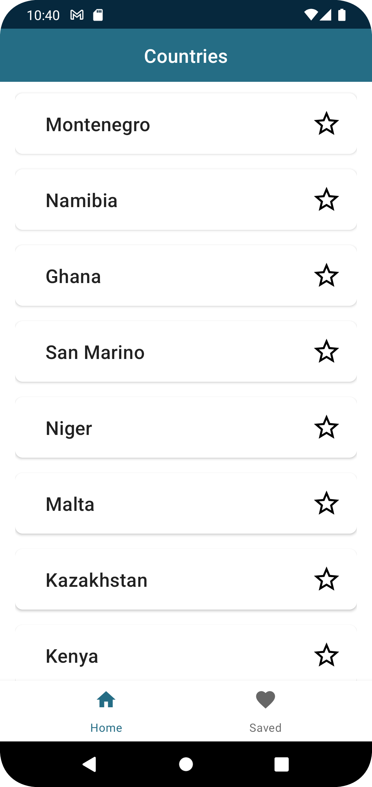
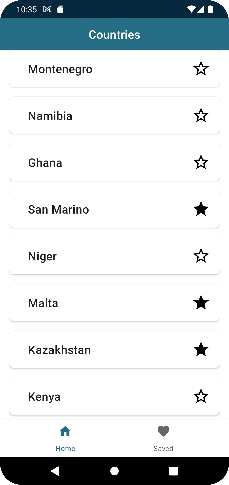
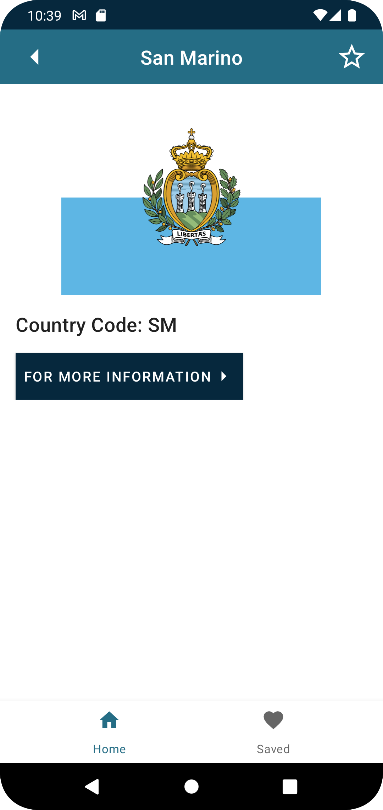
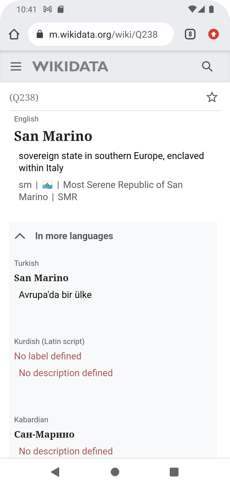
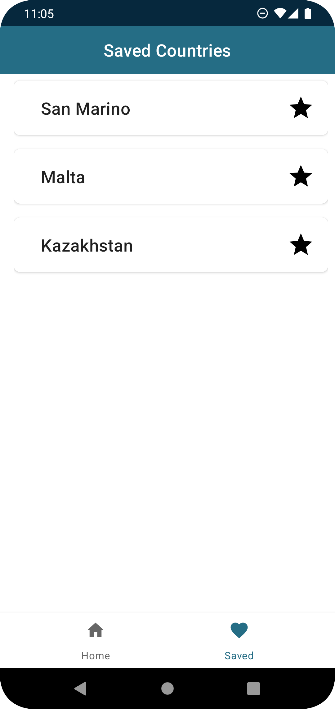

# Countries

This is an app that displaying countries with GeoDB Cities API. You can save countries that you want. From the country details page, you can access the wikidata page with information about that country.

### Includings

- ViewModel
- ViewBinding
- MVVM Architecture
- Kotlin Coroutines
- LiveData
- Retrofit

| Home Page     | Home Page Favorite   | Detail Page |
| ------------- |-------------| -----------|
|    |  |   |
| Detail Page Favorite     | More Info Page   | Detail  Page |
|    |  |   |
